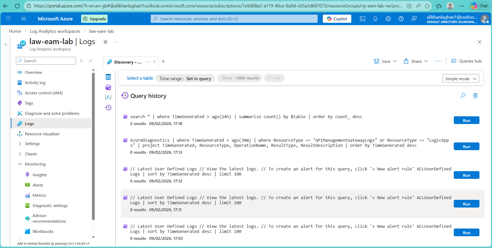
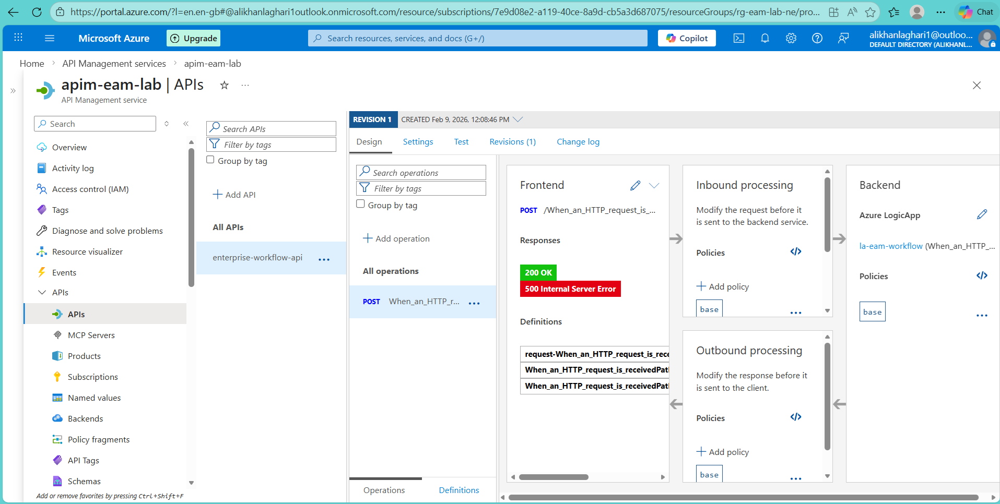

# Phase 5 – Monitoring

## Executive Takeaway
This phase establishes operational monitoring and validates service observability for the application workflow. By centralizing logs and metrics in Azure Log Analytics and verifying real telemetry ingestion, this phase demonstrates production readiness, incident preparedness, and operational control — core responsibilities of an Application Manager in enterprise and public-sector IT environments.

---

## Objective
Ensure production-level observability by centralizing logs and metrics for the enterprise workflow and API gateway.

The focus of this phase is not only configuration, but **verification of telemetry flow**, ensuring the service can be monitored, supported, and operated according to ITIL-aligned service management practices.

---

## Implemented Components

### Log Analytics Workspace
- Central Log Analytics workspace established as the primary monitoring platform.
- Serves as the authoritative source for operational insight, troubleshooting, and audit support.
- Enables correlation of telemetry across application components.

### Diagnostic Settings
- Logic App diagnostics enabled and routed to Log Analytics.
- API Management metrics and diagnostics configured via Azure Monitor.
- Monitoring configured at platform level to support incident investigation and trend analysis.

---

## Monitoring Validation Approach

To confirm that monitoring was functioning as intended, discovery-based KQL queries were executed in Log Analytics. This approach verifies actual data ingestion rather than assuming success based on configuration alone.

kql
search *
| where TimeGenerated > ago(24h)
| summarize count() by $table
| order by count_ desc

This method provides visibility into which telemetry tables are actively receiving data and supports early detection of monitoring gaps.

## Operational Validation

### API Invocation Test (Service-Level Validation)

# Test via APIM (subscription key required)
$subKey = "**************************"
$uri = "https://apim-eam-lab.azure-api.net/enterprise-workflow/When_an_HTTP_request_is_received/paths/invoke"

Invoke-RestMethod -Method Post -Uri $uri `
  -Headers @{ "Ocp-Apim-Subscription-Key" = $subKey } `
  -ContentType "application/json" `
  -Body '{"input":"healthcheck"}'

This test validates:

  - API Management gateway availability
  - Correct backend routing to the Logic App

### Results

- Platform metrics confirmed as actively ingested into Log Analytics.
- API Management diagnostic logs observed in expected propagation state.
- Telemetry pipelines verified as correctly configured and operational.

## Monitoring Evidence

### Log Analytics – Ingestion Verification

### API Management – Successful Invocation

These results confirm that the service is observable and supportable under normal operating conditions.

### Outcome

- Centralized monitoring successfully established.
- Observability validated through real service traffic.
- Operational readiness achieved for incident handling and service support.
- Monitoring foundation in place for future alerting and SLA reporting.

### ITIL / Operations Perspective

- From an ITIL-aligned service management perspective, this phase ensures:
- Monitoring & Event Management capability
- Incident readiness through verified telemetry
- Operational control of application services
- Service assurance through measurable data

### Key Takeaway

- Monitoring is a service capability, not a configuration task.
- By validating telemetry ingestion and service visibility, this phase demonstrates an Application Manager mindset focused on stability, supportability, and operational excellence.

---

### Why this version works well in Norway 🇳🇴
- Uses **operations-first language** (drift, readiness, validation, supportability)
- Avoids hype; focuses on **control, verification, responsibility**
- Maps naturally to:
  - Application Manager  
  - Applikasjonsforvalter  
  - IT Operations / Drift  
  - Municipality / Public Sector IT roles
